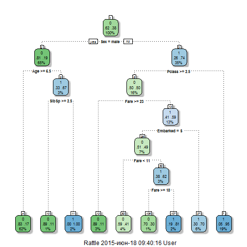
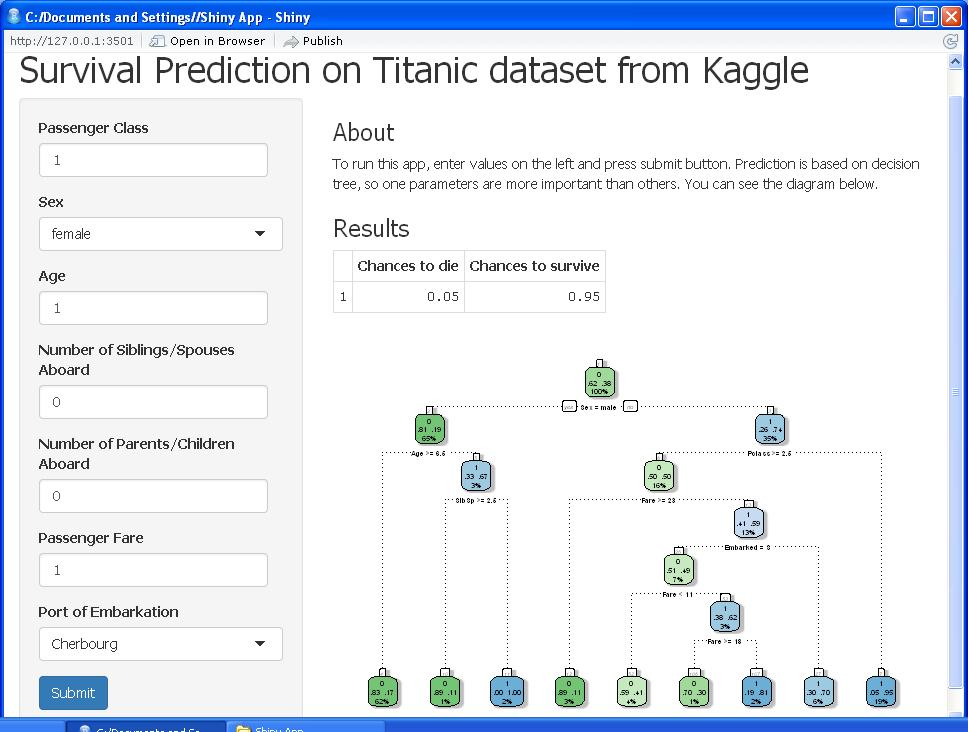

Coursera Developing Data Products Project: Shiny App Titanic
========================================================
author: Larionova Anna
date: 17.06.2015
transition: rotate

Introduction
========================================================

The sinking of the RMS Titanic is one of the most infamous shipwrecks in history.  On April 15, 1912, during her maiden voyage, the Titanic sank after colliding with an iceberg, killing 1502 out of 2224 passengers and crew. This sensational tragedy shocked the international community and led to better safety regulations for ships.

In this app I try to investigate the chanse to survive for passangers of Titanic.

The Algorithm
========================================================


```r
fit <- rpart(Survived ~ Pclass + Sex + Age + SibSp + Parch + Fare + Embarked, data = train, method = "class")
Prediction <- predict(fit, test, type = "prob")
```

Here I use the decission tree to predict chances to survive on few parameters: Passenger Class, Sex, Age, Number of Siblings/Spouses Aboard, Number of Parents/Children Aboard", Passenger Fare, Port of Embarkation. So one parameters are more important than others. You can see it on the  next slide.

Decission Tree
========================================================

 

The most important parameter is gender, second is passenger class, third is age (for men is the most important), etc.

Shiny app
========================================================

To run this app, enter values on the left and press submit button.

